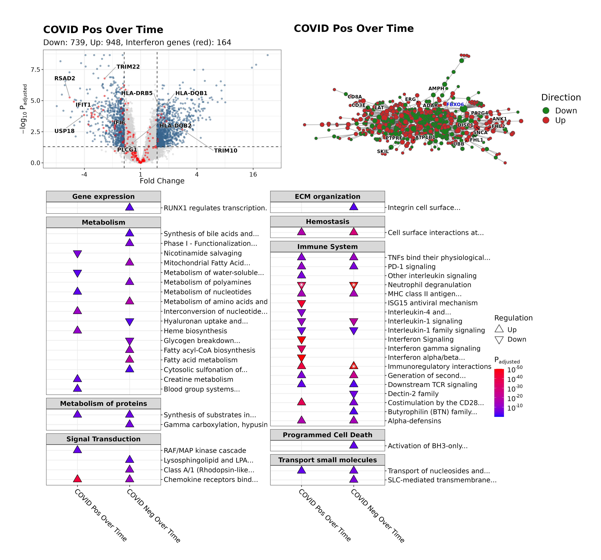

# pathlinkR 

<!-- badges: start -->

[](https://github.com/hancockinformatics/pathlinkR/actions/workflows/R-CMD-check.yaml)
[](https://app.codecov.io/gh/hancockinformatics/pathlinkR?branch=main)
<!-- badges: end -->

## Overview

**pathlinkR** is an R package designed to facilitate analysis DE genes produced
from of RNA-Seq experiments. Our aim with **pathlinkR** is to provide a number
of functions/tools which can be applied to list(s) of DE genes, to help the user
obtain biological insights into their results, and produce publication-ready
figures to summarize these findings.



## Installation
For the time being, **pathlinkR** can be installed from this Github repository
using the [devtools](https://cran.r-project.org/package=devtools) function:
```r
devtools::install_github("https://github.com/hancockinformatics/pathlinkR")
```

## Workflow & functions

The functions provided in **pathlinkR** can be grouped into a number of different
general approaches: 

- Direct visualization of differential expression results:
    - Volcano plots to show the transcriptomic changes in a single condition
    - Heatmaps to compare fold changes of groups of genes across multiple
      conditions
- Protein-Protein Interaction (PPI) network creation and visualization,
  leveraging curated interaction data from [InnateDB](https://www.innatedb.com/)
- A combined interface to multiple pathway enrichment tools, including
  [Reactome](https://reactome.org/) pathways and 
  [MSigDB Hallmark](https://www.gsea-msigdb.org/gsea/msigdb/collections.jsp) 
  gene sets
  - Simple yet effective plots to summarize and compare these findings across
    multiple conditions
  - Pathway enrichment results can also be visualized as a network of connected
    pathways, with the option for static or interactive output

See the vignette for an example workflow including each of the included
functions, and more details on the included methods and how they may be used.

## Contributors
**pathlinkR** was created and developed by Andy An & Travis Blimkie at the CMDR
REW Hancock Lab.

## Versioning
This package makes use of [SemVer](https://semver.org/).

## License
This project uses the GNU General Public License v3.0, available
[here](https://github.com/hancockinformatics/pathlinkR/blob/main/LICENSE).

<br>

[](http://cmdr.ubc.ca/bobh/)
